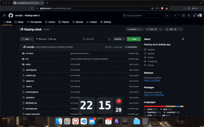

## Floating Clock with Pomodoro Timer



This desktop application offers a convenient floating clock widget with an integrated Pomodoro timer. Designed to enhance productivity, the widget remains on top of all windows, ensuring that you can always keep track of time.

##### Key Features:

- Floating Clock Widget: Stay organized with a clock widget that floats above all windows, providing constant visibility.
- Integrated Pomodoro Timer: Boost your productivity with a built-in Pomodoro timer, allowing you to work in focused intervals.
- Customization Options: Tailor the widget to your preferences by adjusting its size, opacity, and setting a custom Pomodoro timer duration.
- Tauri and Svelte Framework: Built using the Tauri framework for creating lightweight desktop applications and the Svelte framework for efficient and reactive user interfaces.

Whether you're managing your time during work sessions, study sessions, or any other tasks requiring time management, the Floating Clock with Pomodoro Timer offers a seamless solution.

Get started with the repository to explore the codebase, contribute improvements, or customize the application to suit your needs. Thank you for choosing Floating Clock for your timekeeping and productivity needs!

#### Prerequisites:

- **Node Package Manager npm/pnpm/yarn**: Ensure you have npm, pnpm, or Yarn installed to manage dependencies.
- **Rust**: Make sure you have Rust installed for building the application.

### Scripts

**Installing**
```bash
pnpm install
```

**Developing**
```bash
pnpm run tauri dev
```

**Build**
```bash
pnpm run tauri build
```

